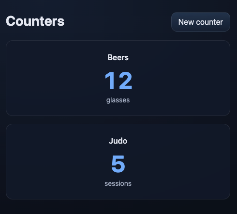

# Tracker

A mobile-friendly counter management system with intuitive gesture-based interactions.



## Features

### 📱 Mobile-First Dashboard
- **Tile-based grid layout** optimized for touch interactions
- **Responsive design** adapts to mobile, tablet, and desktop
- **Dark theme** with smooth animations

### ✨ Gesture Interactions
- **Tap** - Quick increment (tap any counter tile)
- **Swipe Up** - Increment (swipe up on tile)
- **Swipe Down** - Decrement (swipe down on tile)
- **Long Press** - Edit counter (hold for 500ms)

### 🎯 Counter Management
- Create counters with custom name, unit, and default amount
- Edit counter metadata (name, unit, default amount)
- Increment/decrement with custom or default amounts
- Soft delete with event preservation
- Event history tracking with timestamps

### 🎨 User Experience
- **Optimistic UI updates** for instant feedback
- **Visual animations** for each gesture type
- **Error handling** with automatic revert on failure
- **Clean interface** without technical clutter

## Tech Stack

- **Backend**: Kotlin + Spring Boot 4.0
- **Database**: PostgreSQL 16
- **Frontend**: Server-rendered HTML (Thymeleaf) + Vanilla JavaScript
- **Build**: Gradle with Kotlin DSL
- **Migrations**: Flyway
- **Testing**: JUnit + Spring Boot Test

## Quick Start

### Prerequisites
- Java 21+
- Docker & Docker Compose (for PostgreSQL)

### 1. Start PostgreSQL

```bash
docker compose up -d
```

**Note**: If port 5432 is already in use, edit `docker-compose.yml` to use a different port (e.g., `5433:5432`) and set:

```bash
export SPRING_DATASOURCE_URL=jdbc:postgresql://localhost:5433/tracker
```

### 2. Run the Application

```bash
./gradlew bootRun
```

### 3. Open the Dashboard

Navigate to **http://localhost:8080/counters**

## Usage

### Creating a Counter
1. Click "New counter" button
2. Enter name (e.g., "Water")
3. Enter unit (e.g., "glasses")
4. Optionally set default increment amount (default: 1)
5. Click "Create Counter"

### Using Gestures (Mobile/Touch)
- **Tap tile** → Increment by default amount
- **Swipe up on tile** → Increment by default amount
- **Swipe down on tile** → Decrement by default amount
- **Long press tile** → Navigate to edit page

### Using Desktop
- **Click tile** → Increment
- **Long click tile** → Navigate to edit page
- Use edit page for decrement and other actions

### Editing a Counter
1. Long press (or long click) a counter tile
2. Modify name, unit, or default amount
3. Use increment/decrement buttons
4. Delete counter if needed
5. Click "Back to Dashboard" to return

## API Endpoints

### Web UI
- `GET /counters` - Dashboard
- `GET /counters/new` - Create counter form
- `GET /counters/{id}/edit` - Edit counter page

### API (Form-based)
- `POST /counters` - Create counter
- `POST /counters/{id}` - Update counter
- `POST /counters/{id}/increment` - Increment counter
- `POST /counters/{id}/decrement` - Decrement counter
- `POST /counters/{id}/delete` - Soft delete counter

### REST API
- `POST /api/counters` - Create counter (JSON)

Example:
```bash
curl -X POST http://localhost:8080/api/counters \
  -H 'Content-Type: application/json' \
  -d '{"name":"Steps","unit":"steps","defaultAmount":100}'
```

## Development

### Run Tests
```bash
./gradlew test
```

### Generate Coverage Report
```bash
./gradlew test koverHtmlReport
```
View at `build/reports/kover/html/index.html`

### Build
```bash
./gradlew build
```

## Project Structure

```
src/
├── main/
│   ├── kotlin/com/tracker/
│   │   └── counters/
│   │       ├── Counter.kt              # Domain model
│   │       ├── CounterService.kt       # Business logic
│   │       ├── web/                    # Web controllers
│   │       ├── api/                    # REST API
│   │       └── db/                     # Repositories & entities
│   └── resources/
│       ├── templates/counters/         # Thymeleaf templates
│       ├── static/
│       │   ├── app.css                 # Styles & animations
│       │   └── dashboard.js            # Gesture detection
│       └── db/migration/               # Flyway migrations
└── test/                               # Tests
```

## OpenSpec Documentation

This project uses [OpenSpec](https://openspec.dev) for specification-driven development. See:
- `openspec/specs/counters/spec.md` - Current requirements
- `openspec/changes/archive/` - Archived change proposals

## How This Was Built

This entire application was built using AI-assisted development with a specification-first approach. The complete development conversation is documented in [`prompts.md`](prompts.md), showing:

- How features were proposed and refined through conversation
- The OpenSpec workflow for creating change proposals
- Iterative implementation and refinement
- Three major features built from scratch:
  1. Counter creation with UUID identity
  2. Counter updates with event tracking
  3. Mobile-friendly dashboard with gesture interactions

The `prompts.md` file provides a transparent view of the development process, including requirements clarification, design decisions, and implementation steps. It serves as both documentation and a case study for AI-assisted, specification-driven development.

## License

MIT


